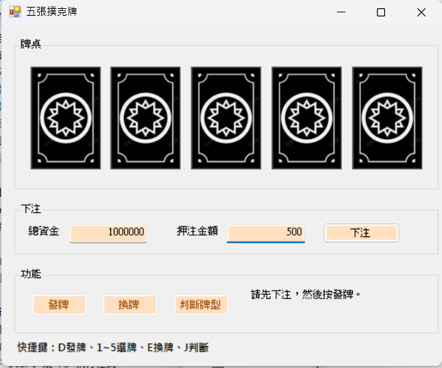

# 五張撲克牌下注遊戲

## 專案簡介
本專案使用 C# Windows Forms App 製作五張撲克牌下注遊戲。

玩家可以輸入押注金額，按下發牌後取得五張牌，
可選擇要保留或更換的牌，最後系統會根據牌型賠率計算中獎金額。

## 功能說明
- 顯示五張撲克牌
- 可輸入押注金額
- 可發牌、換牌、判斷牌型
- 根據牌型賠率計算中獎金額
- 顯示目前總資金
- 加入撲克牌背面圖片
- 支援鍵盤快捷鍵操作

## 鍵盤操作
- Enter：執行目前選取的功能
- B：下注
- D：發牌
- 1～5：選擇第 1～5 張牌
- E：換牌
- J：判斷牌型

## 執行方式
1. 使用 Visual Studio 2022 開啟專案。
2. 開啟 `.sln` 檔案。
3. 按下 Start 或 F5 執行程式。

## 專案畫面

